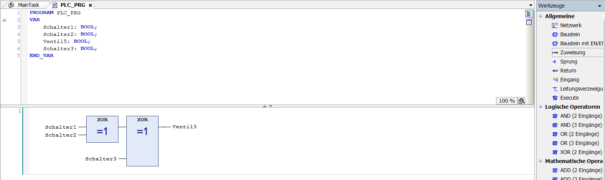

# syt5-tankentleerung
SYT Lab GK9.1.1 Industrielle Programmierung (LISE0)

## Einrichten Standardprojekt

Um ein neues Projekt zu erstellen, im Dashboard auf "Neues Projekt" klicken. Dort kann man zwischen verschiedenen Vorlagen auswählen, es empfiehlt sich für den Emfpang "Standardprojekt" auszuwählen. Anschließend kann man ein Steuerungsgerät auswählen und die zugehörige Programmiersprache setzen. Als Gerät soll **Codesys WinControl V3** ausgewählt werden (virtuelle Steuerung vergleichbar mit Java's JVM) und die darauf laufende Programmiersprache ist **Funktionsbausteine (FUP)**.

## Durchführung der Aufgabe

### Aufgabenbeschreibung

*Ein Tank soll über drei an verschiedenen Orten angebrachten Schaltern S1, S2, S3 entleert
werden können. Das Ventil V5 zum Entleeren soll dabei von jedem Schalter ein und
ausgeschaltet werden können (Funktionsweise wie bei einer Kreuzschaltung in der Elektrik,
Kreuzschaltung = Wechselschaltung mit drei Schaltern).
Das Programm soll in einen zyklischen Task mit einer Zykluszeit von 400ms eingebettet*

Bevor man mit der Aufgabe startet, die wichtigsten Komponenten des Programms aufgelistet:
- **Device:** Ist die Steuerung, auf der das Programm laufen wird
- **MainTask:** Der Task, worin ein Zyklus über alle Programme läuft (die Zykluszeit kann man einstellen)
- **Applicaiton->Programm(z.B PLC_RPG):** Programme für die Steuerung

### Durchführung Aufgabe 1

Um die Zykluszeit einszustellen einen Doppelklick auf "MainTask" tätigen. Im geöffneten Dashboard kann man nun unter dem Feld **Intervall** die Zykluszeit einstellen. Jede 400ms wird der MainTask nun ausgeführt, daher jedes Programm im Task nacheinander alle 400ms abgearbeitet.
Um das Programm zu coden, doppelklick auf das vorerstellte Programm **PLC_RPG**.  
Jedes der 3 Schalter soll das Ventil an- und ausschalten können. Die Schaltung kann man mittels 2 XOR's realisieren:  

    
Sobald eines der Schalter betätigt wird, also den Zustand "1" besitzt, soll das Ventil geöffnet werden.  Dies entpsricht einem logischen XOR.  

#### Programm ausführen

Um die Schaltung zu testen, kann man unter **Online->Simulation** die Schaltung simulieren. Oben dann auf **Play** drücken damit der MainTask ausgeführt wird. Standardmäßig sind alle Werte FALSE. Zu Testzwecken will man jedoch verschiedene Werte überpüfen. Um Werte von den Schaltern zu verändern kann man oben in der Tabelle mit den Variablen unter **Vorbereiterter Wert** einen neuen Wert setzen. Zum Testen wird der Schalter1 auf TRUE gesetzt. Um die Veränderung auf den Schalter tatsächlich zu übernehmen Rechtsklick auf **Applikation->Alle Werte von ... schreiben**. Das Ventil sollte nun den Zustand TRUE haben (also geöfffnet).

### Durchführung Aufgabe 2

*Erweitere das Projekt mittels Strukturiertem Text (ST) um folgende Funktion:
Zwecks Überlaufschutz wird ein digitaler Sensor S7 verbaut, der bei einer per Variable
einstellbaren Maximalfüllhöhe des Tanks ein Signal liefert. Sollte dieser ansprechen, so muss
das Ventil V5 umgehend geöffnet werden. Liefert S7 kein Signal mehr, soll das Ventil (einfache
Variante) unabhängig von S1,S2,S3 geschlossen werden oder alternativ der vorherige Zustand
wiederhergestellt werden (komplexere Variante)*

Es wird ein neues Programm erstellt. Dazu **Rechtsklick auf Application->Objekt hinzufügen->PAO** Dort nun als Sprache ST wählen.  

Damit der Sensor S7 und das Ventil V5 global erreichbar sind, muss ein File erstellt werden worin globale Variablen gespeichert werden. Dafür **Rechtsklick Application->Objekt hinzufügen->Globale Variablenliste...**. Folgende Variablen werden erstellt:  

    {attribute 'qualified_only'}
    VAR_GLOBAL
    Ventil5: BOOL;
    Sensor7: BOOL;
    END_VAR

Im Ueberlaufprogramm werden Variablen für die aktuelle Literanzahl und das Maximum definiert. Falls die aktuelle Anzahl gleich oder über das Maximum ist, soll der Sensor aktiv sein:

    PROGRAM Ueberlaufschutz
    VAR
    maximum: INT:=20;
    current: INT:=0;
    END_VAR

    IF(current>=maximum) THEN
  	 GVL.Sensor7:=TRUE;
    ELSE
  	 GVL.Sensor7:=FALSE;
    END_IF

Um den Sensor nun einzubinden, geht man zurück zum ursprünglichen Programm. Die neue Schaltung mit dem Überlaufsensor schaut folgendermaßen aus:

  
Es wird lediglich an das XOR-Glied der 3 Schalter ein OR-Glied mit dem Eingang des Sensors angehängt. Das Ventil wird an den Ausgang des OR-Gatters gesetzt. Was hat sich an der Schaltung geändert? Sobald der Sensor einen Überlauf meldet wird der Zustand auf "1" gesetzt und somit das Ventil sofort geöffnet, unabhängig davon ob die 3 Schalter das Ventil schließen wollen (also am Eingang des OR's der Zustand "0" vorliegt).

Damit das Programm im MainTask ausgeführt wird muss man als erstes einen Doppeklick auf MainTask tätigen und anschließend das neu erstellte Programm, in dem Fall "Ueberlaufschutz", in den MainTask per Drag & Drop ziehen.

### Durchführung Aufgabe 3

*Natürlich muss der Tank auch gefüllt werden. Dazu soll alle 8 Sekunden das Einlaufventil V9
für 5 Sekunden geöffnet werden. Natürlich muss bei einem signalisierten Überlauf das
Einlaufventil verschlossen werden.*

Damit ein Einlaufventil realisiert werden kann, muss ein neues Programm "Einlauf" erstellt werden. Das Programm wird mittels Funktionsbausteinen realisiert. Wie die Aufgabenbeschreibung hindeutet, braucht man für die Schaltung Timer. Diese sind unter **Werkzeuge->Funktionsbausteine->TON** zu finden. Für die Schaltung werden 2 Timer benötigt; einen für die Sequenz von 8 Sekunden und einer der 5 Sekunden lang das Einlauventil öffnet:  

  
Der Timer hat 3 wichtige Eigänge:
- IN: Input, wenn der Eingang auf TRUE gesetzt ist, startet der Timer
- PT: Die Dauer für die Verzögerung
- Q: Ausgang, ist solange aktiv bis der Input auf FALSE ist

trigger ist eine BOOL Variable. Diese ist am Anfang FALSE gesetzt. Da am Input NOT trigger eingstellt ist, beginnt der Timer (da NOT FALSE = TRUE). Als Verzögerung wurden 8 Sekunden unter dem PT-Eingang eingestellt. Nun muss noch der 5-Sekunden-Timer und die Verknüpfung mit dem Überlaufsensor hergestellt werden:    

  
Wie man sehen kann wurde ein weiterer Timer (TON_Timer) an den Ausgang des ersten angehängt. Nach einer Verzögerung von 8 Sekunden wird am Ausgang des TON_Sequence-Timers das "TRUE-Signal" weitergeleitet an den nächsten TON_Timer:

  
Dadurch beginnt dieser weitere 5 Sekunden zu verzögern, bis das Signal am Ausgang die Variable "trigger" auf TRUE setzt:  

  
Dies wiederum bewirkt eine Art Kettenreaktion: Die Signal-Weiterleitung bei TON_Sequence und somit auch an der gesamten nachfolgenden Schaltung wird unterbrochen, da NOT trigger = FALSE ergibt. Dadurch, dass der Input bei TON_Sequence auf FALSE springt, wird der Input bei TON_Timer ebenfalls FALSE. Dies wiederum heißt, dass die Variable trigger wieder auf FALSE gesetzt wird und der ganze Zyklus wieder von neu abläuft:

  
Wie man an den Abbildungen erkennen kann, wurde zwischen den 2 Timern der Sensor und das Einlaufventil eingebunden. Das Signal der Zeitschaltung wird alle 8 Sekunden in einer Zeitspanne von 5 Sekunden UND-Verknüpft mit dem negierten Signal des Ablaufsensors. Sobald der Sensor7 auf FALSE steht, also das Ventil geschlossen ist, wird das Einlaufventil Ventil9 alle 8 Sekunden geöffnet (Da 1 & 1 = 1).

### Aufgabe Eigener Funktionsbaustein

*Erstelle einen Funktionsbaustein „Kreuzschaltung“ mit drei Eingängen und einem Ausgang, der
die Funktion der Kreuzschaltung aus 1. kapselt. Teste den Funktionsbaustein, indem Aufgabe 1
in einem neuen Programm damit umgesetzt wird (der ursprüngliche Code von Aufgabe 1 muss
erhalten bleiben, also wirklich ein neues Programm erstellen!)*

Um dies zu realisieren navigieren auf **Rechtsklick Application->Objekt hinzufügen->POU->Funktionsbaustein unter Radiobuttons wählen und Namen eingeben->Erstellen->Input und Output Variablen definieren->Schaltung erstellen**
Die Schaltung sollte folgendermaßen ausschauen:

  

Den erstellten Baustein kann man nun weiter verwenden in anderen Programmen, indem man bei Werkzeuge unter **Bausteine** diesen auswählt:

  

### Handskizze

### Quellen
Keine Quellen
