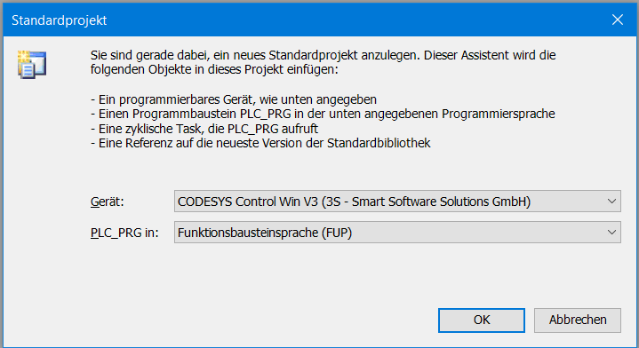

# syt5-tankentleerung
SYT Lab GK9.1.1 Industrielle Programmierung (LISE0)

## Einrichten Standardprojekt

Um ein neues Projekt zu erstellen, im Dashboard auf "Neues Projekt" klicken. Dort kann man zwischen verschiedenen Vorlagen auswählen, es empfiehlt sich für den Emfpang "Standardprojekt" auszuwählen. Anschließend kann man ein Steuerungsgerät auswählen und die zugehörige Programmiersprache setzen. Als Gerät soll **Codesys WinControl V3** ausgewählt werden (virtuelle Steuerung vergleichbar mit Java's JVM) und die darauf laufende Programmiersprache ist **Funktionsbausteine (FUP)**.

## Durchführung der Aufgabe

### Aufgabenbeschreibung

*Ein Tank soll über drei an verschiedenen Orten angebrachten Schaltern S1, S2, S3 entleert
werden können. Das Ventil V5 zum Entleeren soll dabei von jedem Schalter ein und
ausgeschaltet werden können (Funktionsweise wie bei einer Kreuzschaltung in der Elektrik,
Kreuzschaltung = Wechselschaltung mit drei Schaltern).
Das Programm soll in einen zyklischen Task mit einer Zykluszeit von 400ms eingebettet*

Bevor man mit der Aufgabe startet, die wichtigsten Komponenten des Programms aufgelistet:
- **Device:** Ist die Steuerung, auf der das Programm laufen wird
- **MainTask:** Der Task, worin ein Zyklus über alle Programme läuft (die Zykluszeit kann man einstellen)
- **Applicaiton->Programm(z.B PLC_RPG):** Programme für die Steuerung

### Durchführung

Um die Zykluszeit einszustellen einen Doppelklick auf "MainTask" tätigen. Im geöffneten Dashboard kann man nun unter dem Feld **Intervall** die Zykluszeit einstellen. Jede 400ms wird der MainTask nun ausgeführt, daher jedes Programm im Task nacheinander alle 400ms abgearbeitet.
